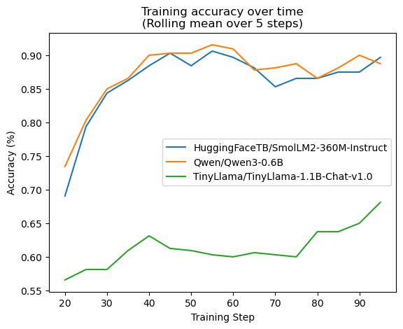
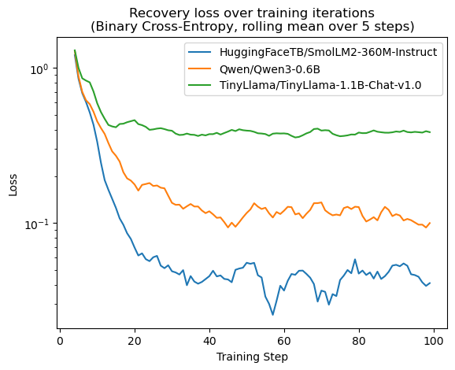
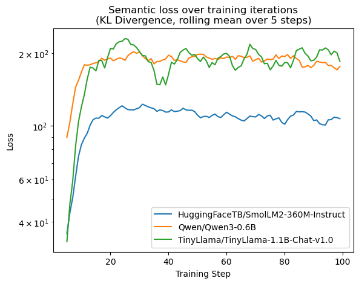

## StegaGen

Perform steganography by fine-tuning pre-trained LLMs to hide secret bits in token probabilities. A corresponding decoder network can retrieve these secret bits again from the encoded message.

Architecture:
- Any causal LM as a generation base (Tested with SmolLM2-360M-Instruct, Qwen3-0.6B and TinyLlama-1.1B-Chat)
- A learned vocabulary mask that masks token probabilities based on secret bits
- A decoder to retrieve secret bits

### Training

Training is driven by encoder/decoder performance and regulated by KL semantic loss against a frozen copy of the base language model. A learning schedule is implemented to weight secret recovery performance more heavily during initial training, and shift to semantic preservation once the communication channel between encoder and decoder is established. 

### Results

After 100 training steps, the following secret recovery accuracy was achieved on the three tested models:



Both the SmolLM-360M and Qwen3-0.6B perform very well with our implementation, with Qwen3 producing slightly more natural looking output text (despite possessing worse semantic loss metrics). These results allow for effective steganographic communication, especially when combined with traditional redundancy and error-correcting techniques. 

Training graphs for secret recovery loss ($l_{rec}$) and semantic loss ($l_{sem}$) are shown below.





### Requirements

Installation with Conda is recommended. Tested with Python `3.12`. Run the following to create the environment:

```
conda create -n stega python=3.12
conda activate stega
conda install ipykernel pytorch pytorch-cuda nltk datasets transformers[torch] tokenizers huggingface_hub pandas matplotlib -c nvidia -c pytorch
```